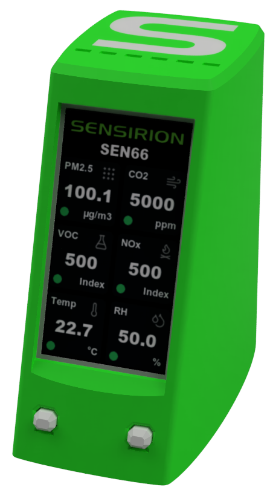
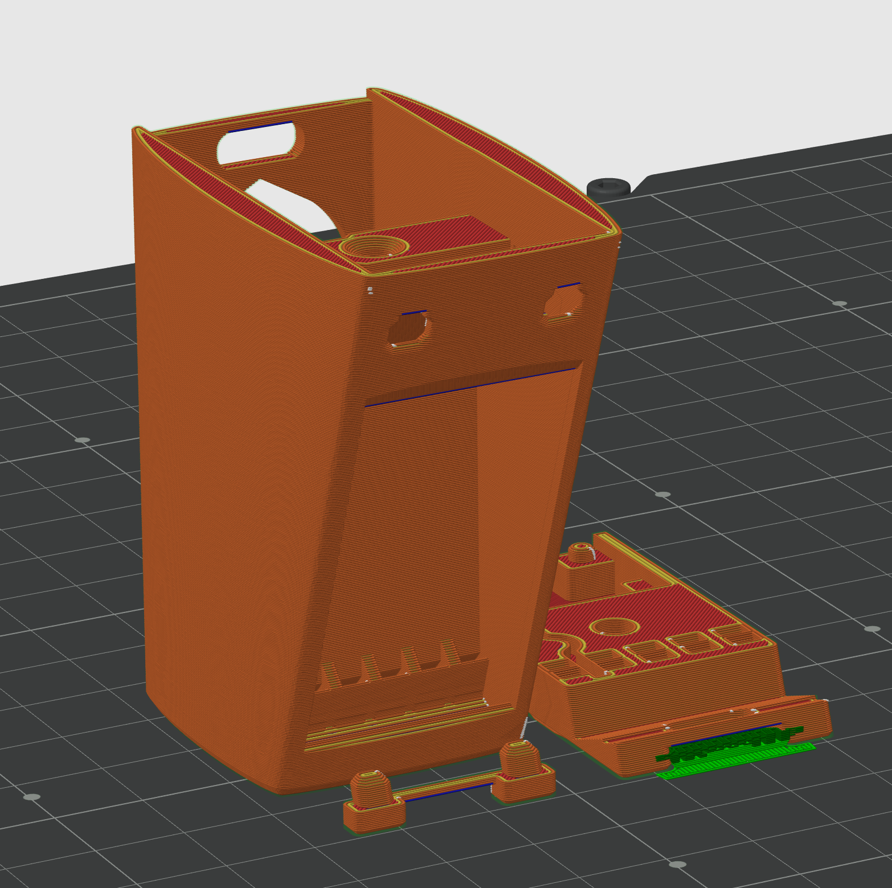

# IAQ Monitor

An Indoor Air Quality Monitor using the [Sensirion SEN66](https://sensirion.com/de/produkte/katalog/SEN66) sensor and a [LilyGo T-Display-S3](https://lilygo.cc/products/t-display-s3?variant=42284559827125)

<p align="center">
  
</p>

## Features

- Real-time monitoring of:
  - Particle mass concentrations (PM1.0, PM2.5, PM4.0, PM10.0)
  - Temperature
  - Humidity
  - VOC
  - NOx
  - CO2
- Chart screens with 2min30, 60min and 24h resolution
- Settings menu:
  - Perform forced recalibration of CO2
  - Set alititude for CO2 compensation (apply this before the forced recalibration)
  - Switch resolution on chart screen
  - Change screen Brightness
- Serial output with both processed and raw values

## Hardware Requirements

- [Sensirion SEN66](https://sensirion.com/de/produkte/katalog/SEN66), which can be had at many distributors
- [LilyGo T-Display-S3](https://lilygo.cc/products/t-display-s3?variant=42284559827125) (make sure to get the non-touch version without soldered pin headers)
- [SEN5x Jumper Wire](https://sensirion.com/de/produkte/katalog/SEN5x-jumper-wire) - alternatively you can use [Sparkfun JST-GHR-06V Cable](https://www.sparkfun.com/breadboard-to-jst-ghr-06v-cable-6-pin-x-1-25mm-pitch.html), just be ware that the colors are different! Both cables can be had at many distributors.
- [USB C Breackout Board](https://www.sparkfun.com/sparkfun-usb-c-breakout.html) (Knock-offs can also be found on Aliexpress and the likes)
- 3D Printer to print the housing
- M3x10 Bolt
- (optional) [M3 threaded insert](https://www.3djake.com/3djake/threaded-inserts-50-piece-set)

## Software Requirements

- VSCode with PlatformIO (or forks of VSCode like [Cursor](https://www.cursor.com/))

## Hardware Assembly

### 3D Printing

In the [3D Models](3D%20Models) folder, you can find the Fusion 360 source file and STEP-File exports of all the parts that you need. You need the following parts:
- Top Shell - Different versions for:
  - With Logo for dual color printing or without 
  - With heat insert or without if you want to screw directly into the plastic
- Bottom Shell- Two versions for:
  - Original Sparkfun USB C boards with 1.6mm PCB thickness
  - Version for some Aliexpress knockoffs that can be only 1.2mm thick
- Buttons

Print the parts in the following orientation. The only part that needs some paint-on support is the area of the bottom shell where you can find the USB port of the LilyGo T-Display S3

<p align="center">
  
</p>

After printing make sure that the inside part of the top shell where the buttons should sit is flat.

### Wiring

<p align="center">
  
</p>

The instruction is for the [SEN5x Jumper Wire](https://sensirion.com/de/produkte/katalog/SEN5x-jumper-wire), if you use the [Sparkfun JST-GHR-06V Cable](https://www.sparkfun.com/breadboard-to-jst-ghr-06v-cable-6-pin-x-1-25mm-pitch.html), just be ware that the colors are different!

- Remove the purple and blue cable from the connector
- cut the remaining 4 cables to a length of 110mm
- from the leftovers cut 75mm of the black and red wire
- Connect the USB C Board
  - 75mm:
    - Red to VBUS
    - Black to GND
- Connect T-Display S3
  - 75mm:
    - Red to 5V
    - Black to GND
  - 110mm with connector:
    - Red to 3V3
    - Black to GND
    - Green to GPIO18
    - Yellow to GPIO17

### Assembly

0. If you chose the version with insert, use the soldering iron to insert the M3 threaded insert in to the top shell
1. Insert the LilyGo T-Display-S3 into the top shell
2. Insert the buttons
3. Connect the SEN66 and push it in
4. Clip in the wires from the SEN66 and push the remaining wires in to the cavity behind the T-Display-S3
5. Insert the USB C breakout board into the bottom shell and push the wires in the canal
6. Close everything up with the screw, make sure not to pinch any wires. Test the buttons for smooth operation. If the they are not clicky, you either have to smooth the surface on the inside where the button sit, or you can try to have the screw a bit looser.

## Installation

1. Clone the repository:
   ```bash
   git clone https://github.com/Klabbob/IAQ-Monitor.git
   ```

2. Open the project in PlatformIO

3. Install dependencies:
   ```bash
   pio lib install
   ```

4. Build and upload to your device

## Sensor Data

<details>
<summary>Sensor Data</summary>

### Processed Values

- Particle Mass Concentrations (μg/m³):
  - PM1.0
  - PM2.5
  - PM4.0
  - PM10.0

- Environmental Parameters:
  - Temperature (°C)
  - Humidity (%RH)

- Air Quality Indices (0-500):
  - VOC Index
  - NOx Index

- Gas Concentration:
  - CO2 (ppm)

### Raw Values

- Environmental Parameters:
  - Raw Humidity: Scaled with factor 100 (RH [%] = value / 100)
  - Raw Temperature: Scaled with factor 200 (T [°C] = value / 200)

- Gas Sensors:
  - Raw VOC: Raw ticks without scale factor
  - Raw NOx: Raw ticks without scale factor
  - Raw CO2: Not interpolated CO₂ concentration [ppm]

### Raw Value Notes

- If humidity or temperature values are unknown, 0x7FFF is returned
- If VOC, NOx, or CO2 values are unknown, 0xFFFF is returned
- During the first 10-11 seconds after power-on or device reset, NOx will be 0xFFFF
- During the first 5-6 seconds after power-on or device reset, CO2 will be 0xFFFF
</details>

## Serial Output

The device outputs data in the following tab-separated format:

```
PM1.0	PM2.5	PM4.0	PM10.0	RH	T	VOC	NOx	CO2	Raw RH	Raw T	Raw VOC	Raw NOx	Raw CO2
12.3	34.5	56.7	78.9	45.6	23.4	120	80	400	45.60	23.40	100	80	400
```

- The first line is a header describing each column.
- The second and subsequent lines are sensor readings, tab-separated, in the order shown above.

## Development

### UI
The UI is built with [SquareLine Studio](https://squareline.io/downloads). Due to the limitiations of the free license tier, the setting screens are designed in a separate project. The projects can be found in the [src/ui_Settings](src/ui_Settings) folder. 

You can make changes to the UI by opening the project file (.spj) in SquareLine Studio. Go to File->Project Settings and set the UI Files Export Path to the `src/ui` or `src/ui_Settings` respecitively as SquareLine Studio only takes absolut paths. Then make your adjustments and go to Export->Export UI Files.

It is necessary to manually assembly the two ui exports. The main screens will be directly exported to the [src/ui](src/ui) folder, the setting screens to the [src/ui_Settings](src/ui_Settings) folder. 

1. Copy over all screen files (ui_XYZScreen.c) to [src/ui](src/ui) from [src/ui_Settings](src/ui_Settings)
2. Copy over all image files (ui_img_XYZ.c) that are not already in [src/ui](src/ui)
3. Copy all unique parts of ui.c and ui.h in [src/ui_Settings](src/ui_Settings) into the respective files in [src/ui](src/ui)
4. Repeat the same for the filelist.txt and CMakeLists.text files.

Contgratulations, you merged both projects. If you add new screens, make sure to update display_task.h and display_task.cpp. If you add a lot of new stuff, you might need to increase LV_MEM_SIZE in lv_conf.h

### Known Bugs

- Screen sometimes not fully refreshing when switching screen showing remenants of previous screens
- ledcWrite function in setDisplayBrightness not always setting 100% duty cycle correctly

### TODO

- [ ] Implement offset compensation based on screen brightness

## License

This project is licensed under the MIT License - see the LICENSE file for details. 